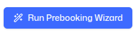
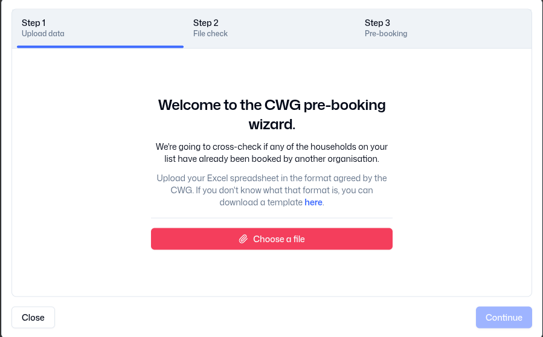
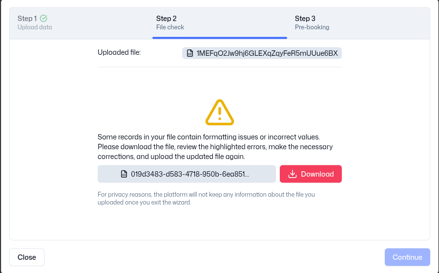
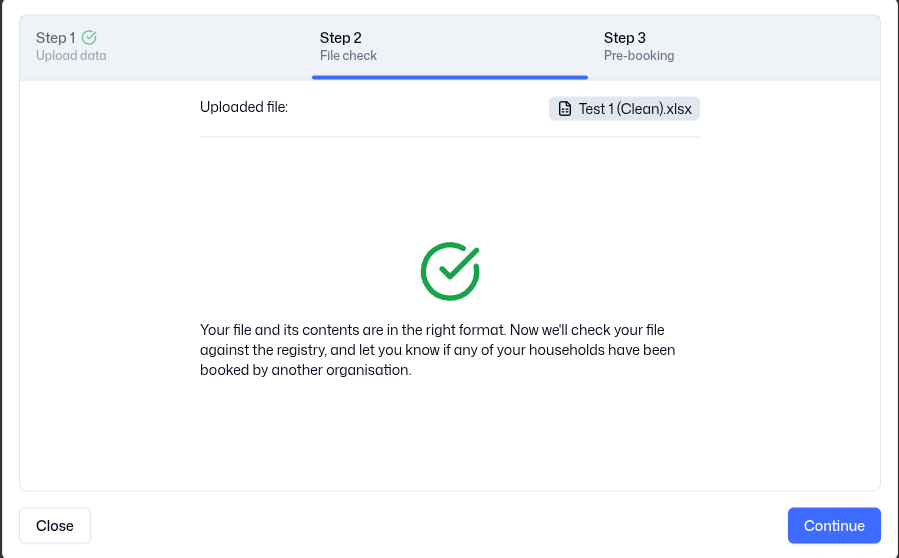
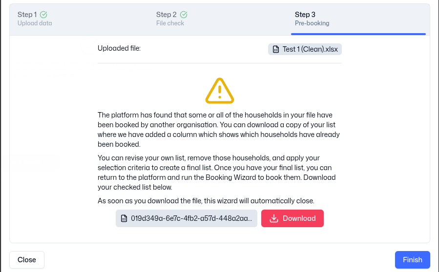
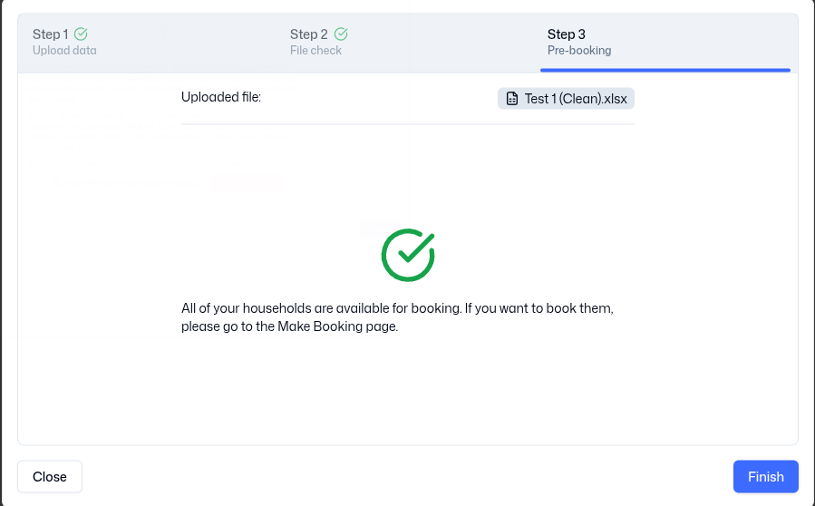

# How to manage Bookings

The Booking section of the menu on the left gives you three options:

* [Pre-booking Check](bookings.md#pre-booking-check). This menu option will take you to a page where you can check if your households are already in the registry before you finalise your booking list.
* [Make Bookings](bookings.md#make-bookings). This menu option will take you to a page where you upload your booking sheet and check if any households are already in the registry.
* [View Bookings](bookings.md#view-bookings). This menu option will take you to a page where you can view all of the previous households which you have booked.

Note: The Pre-booking Check and the Booking Wizard are identical *except* the Booking Wizard allows you to make a booking at the end of the process.

If you are still preparing your final booking list, you should run the Pre-booking Check. If you have already finalised your booking list, you should run the Booking Wizard.

Whether you are Pre-Booking or Booking, you should upload files in the CWG-agreed template. You can download the template using the "Download template" button in the top right corner.

## Pre-booking Check

On this page you can download the Booking Template and run a Pre-booking Check to check if your households are available.

You need to upload your pre-booking beneficiary list in a template agreed by the Cash Working Group. You can download a copy by clicking on the “Download template” button in the top right corner.

Once your pre-booking list is in the format provided by the template, you can click on the “Run Pre-Booking Wizard” button to start.

When you click on the button “Run Pre-Booking Wizard”, the following pop-up box will appear.

### Pre-Booking Check

The Pre-Booking Check will take you through three steps. You must complete each step to complete the deduplication process.

#### Step 1: File Upload

When you press the button “Choose a file”, you will see the usual upload prompt which your device uses.

Choose a file from your device or from cloud storage. If you select the wrong file, you can press Remove and select another file.

Once you have selected the correct File, press “Continue” to go to the next stage of the deduplication process.

#### Step 2: File Checking

The Wizard will check if your uploaded file uses the correct template, if your data is incorrectly formatted, and if there are duplicates within the file.

If you have not used the correct template or your data is incorrectly formatted, you will see the following error message.

The Wizard will ask you to download the file in Excel format, correct any errors, and then upload the file again.

The Excel file will look exactly the same as your original file, except any errors will be highlighted in red. A new column is added to give you additional information about the error.

If your uploaded file is in the correct template, your data is correctly formatted, and there are no duplicates, the Wizard will accept the file. You should click on the “Continue” button.

### Potential Errors

There are a number of potential errors which your spreadsheet might contain:

* First check that you are using the right template, and that all the headers are correct.
* Incorrect ID format. Check that your ID numbers have the correct number of digits.
* Invalid modality. Check that you have entered the modality correctly, including checking your spelling.
* Invalid amount. Check that you have entered the correct amount according to CWG policy.
* Currency. Check that you have entered the correct currency.
* Start Date / End Date
* Rounds

#### Step 3: Registry Check

When you click on the “Continue” button, the Wizard will check the data in your uploaded file against all the data that is already stored in the platform registry.

If another organisation has already booked any of your households, the Wizard will inform you and ask you to download a file in Excel format.

The Excel file will look exactly the same as your original file, except any households which have been booked by another organisation will be highlighted in red.

A new column is also added on the right which tells you which organisation has booked that household, and the scheduled end date for their assistance.

This will enable CWG members to identify when there is duplication of registration, and avoid duplication of assistance.

When you receive this information, you should update your organisation’s internal records to reflect changes to your final list.

If all of the households on your list are available for booking, the Wizard will ask you to run the Booking Wizard to complete your booking process.

Please remember that your list will *not* be uploaded to the registry until you complete the booking process using the Booking Wizard.

## Make Bookings

On this page you can download the Booking Template and activate the Booking Wizard to guide you through the booking process.

You need to upload your booking list in a template agreed by the Cash Working Group. You can download a copy by clicking on the “Download template” button in the top right corner.

Once your booking list is in the format provided by the template, you can click on the “Booking Wizard” button to start.

When you click on the button “Booking Wizard”, the following pop-up box will appear.

### The Booking Wizard

The Booking Wizard will take you through three steps. You must complete each step to complete the deduplication process.

#### Step 1: File Upload

When you press the button “Choose a file”, you will see the usual upload prompt which your device uses.

Choose a file from your device or from cloud storage. If you select the wrong file, you can press Remove and select another file.

Once you have selected the correct File, press “Continue” to go to the next stage of the deduplication process.

#### Step 2: File Checking

The Wizard will check if your uploaded file uses the correct template, if your data is incorrectly formatted, and if there are duplicates within the file.

If you have not used the correct template or your data is incorrectly formatted, you will see the following error message.

The Wizard will ask you to download the file in Excel format, correct any errors, and then upload the file again.

The Excel file will look exactly the same as your original file, except any errors will be highlighted in red. A new column is added to give you additional information about the error.

If your uploaded file is in the correct template, your data is correctly formatted, and there are no duplicates, the Wizard will accept the file. You should click on the “Continue” button.

#### Step 3: Registry Check

When you click on the “Continue” button, the Wizard will check the data in your uploaded file against all the data that is already stored in the platform registry.

Any households which you have uploaded which are not already in the registry, will be added to the registry. This is done automatically.

If another organisation has already booked any of your households, the Wizard will inform you and ask you to download a file in Excel format.

The Excel file will look exactly the same as your original file, except any households which have been booked by another organisation will be highlighted in red.

A new column is also added on the right which tells you which organisation has booked that household, and the scheduled end date for their assistance.

This will enable CWG members to identify when there is duplication of registration, and avoid duplication of assistance.

When you receive this information, you should update your organisation’s internal records to reflect changes to your final list.

## View Bookings

On this page you can view the bookings which your organisation has made. You cannot view the bookings made by other organisations.

You can see the National ID number of the Head of Household and Spouse, and details about duration of the assistance which you are providing them.

You can search for specific households or bookings using the search function. You can search by ID number, by activity, by start and end dates, and by date of booking.

