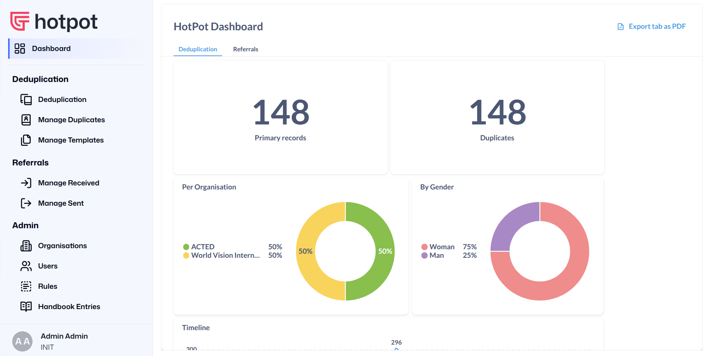
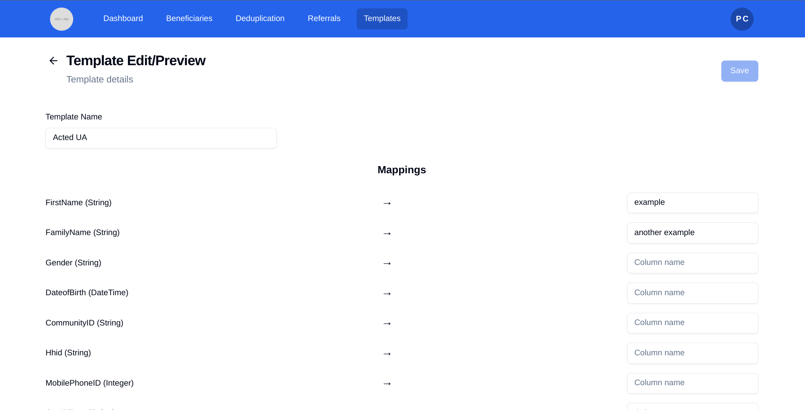
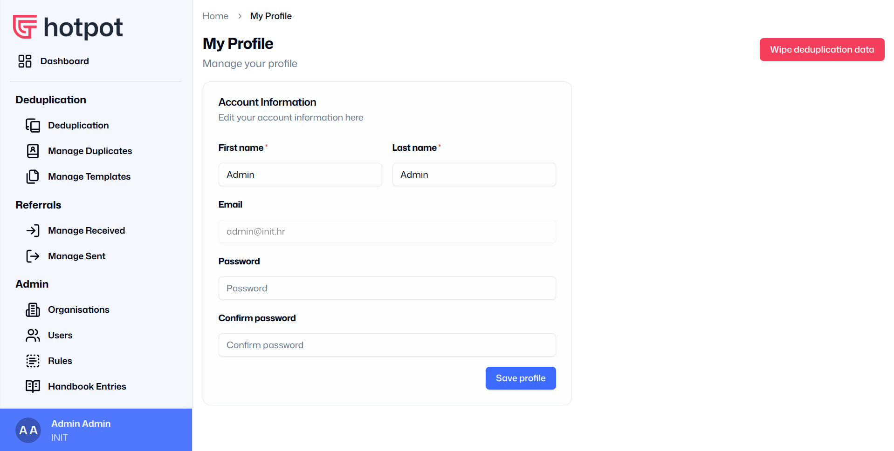
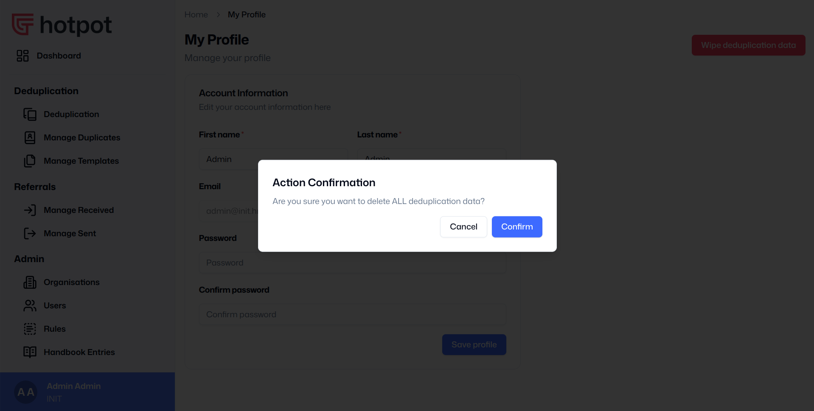

# Accessing the Platform Functions

Once you are logged in, the first thing you will see is the Dashboard Page. You can also reach this page by clicking on the “Dashboard” button at the top of the left menu.

In the main window you will see various analytics relating to the platform. On the left side of the screen is the menu. Your organisation may give you permission to use the [Booking](bookings.md#how-to-manage-bookings) function, [Deduplication](deduplication.md#how-to-manage-deduplication) function, or the [Referrals](referrals.md#how-to-manage-referrals) function, or a combination of functions.

In the bottom left of the screen is the admin button. If you click on it, it will open a menu with the following options:

1. Go to your profile page;
2. Change the platform theme (between light and dark themes);
3. Change the platform language (depending on what languages are available);
4. Sign out of your profile.

## My Profile

On your Profile page, you can edit your First name and Last name, your email, and your password. After you make any changes, press the “Save profile” button.

In the top right corner of the screen is a button “Wipe deduplication data”. If you press this button, you will see a pop-up box asking if you are sure that you want to delete the data on your organisations account. Do not press this button unless you are 100% certain that you want to delete all the data which you have previously uploaded.

## Analytics

The Dashboard contains a range of analytics which developed with the platform users. The Dashboard has two tabs:

### Deduplication tab

This tab shows analytics relating to the deduplication function.

### Referrals tab

This tab shows analytics relating to the referrals function.

