# How to manage Deduplication

The Deduplication section of the menu on the left gives you three options:

* [Deduplication](deduplication.md#deduplication). This menu option will take you to a page where you upload your data and check for potential duplicates.
* [Manage Duplicates](deduplication.md#manage-duplicates). This menu option will take you to a page where you check and confirm potential duplicates.
* [Manage Templates](deduplication.md#manage-templates). This menu option will take you to a page where you can create a template that will enable you to upload your data.

Before you start to use these options, your organisation will need to establish Rules for checking duplicates. Rules are created by the administrator for your organisation, so if you want to know what rules are being used, ask your administrator. 

## Deduplication

On this page you can see who has uploaded data, the name of the file that they have uploaded, the number of duplicates in those files, and when the deduplication records were created and updated.

In the top right corner, you see a blue button which activates the Deduplication Wizard. Click on this button and the Wizard will guide you through the deduplication process.

### The Deduplication Wizard

The Deduplication Wizard will take you through three steps. You must complete each step to complete the deduplication process.

#### Step 1: File Upload

The deduplication wizard can automatically “translate” the fields from your organisation’s dataset into the standardised fields used by the platform.

In order to do this it uses a [Template](deduplication.md#manage-templates). Your organisation can set up one or more Templates which will act as the translation layer for your data.

This enables your organisation to use the platform without you changing any of your internal systems, making it easier to share data with others.

The Deduplication Wizard starts by asking you to select the relevant Template. Use the dropdown menu to select the Template set up by your organisation.

If you do not select a Template, you will see a message to tell you that a Template is required. You will not be able to continue until you select a Template.

If you do not see your Template in the dropdown menu, you can either contact your organisation administrator and ask them to create one, or [create a Template yourself](deduplication.md#manage-templates).

Once you have selected a Template, you can choose a file to deduplicate. When you press the button “Choose a file”, you will see the usual upload prompt which your device uses.

Choose a file from your device or from cloud storage. If you select the wrong file, you can press Remove and select another file.

Once you have selected the relevant Template and the correct File, press “Continue” to go to the next stage of the deduplication process.

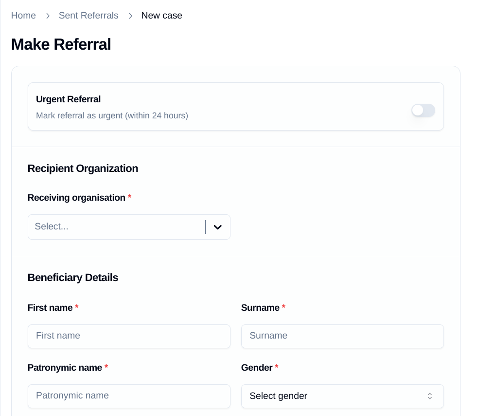

#### Step 2: Internal File Deduplication

Your organisation may already have deduplicated your internal records, but the Wizard will check to see if there are any duplicate records within your uploaded file.

If there are any duplicate records in your uploaded file, it will tell you how many, and offer you the option to download an Excel file which shows you those duplicates.

If you press the Download button, this file will be downloaded to your device or cloud storage. You can then open the file to check and edit the duplicates on your device.

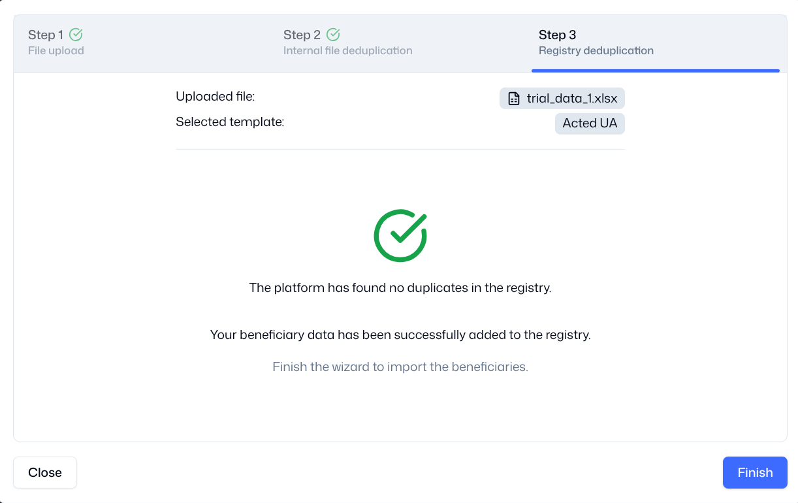

Once you have edited the duplicates on your device, you should return to Step 1 of the Wizard and upload the corrected file.

When you upload a file which contains no duplicate records, you will see a message which confirms that the platform has found no duplicate records in the file.

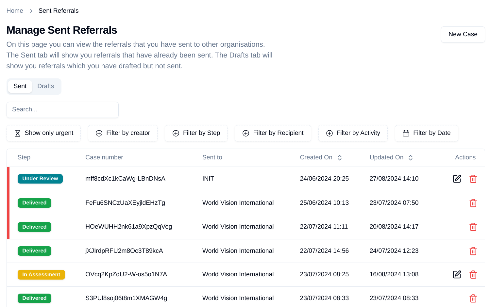

The Wizard will confirm that you have uploaded a file with no duplicates in it, and you can press the “Continue” button to continue to the next step.

#### Step 3: Registry Deduplication

The Wizard will add your beneficiary data to the shared Registry, and check to see if your uploaded file has any potential duplicate records with the records already held in the Registry.

If your file did not contain any duplicates, you will see the following screen. You can click the “Finish” button to close the Wizard, and you do not need to take any further action.

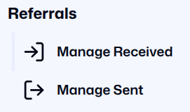

If your file contained duplicates, you will see the following screen. You can click the “Finish” button to close the Wizard, and then visit the “[Manage Duplicates](deduplication.md#manage-duplicates)” page to view and manage the potential duplicates.

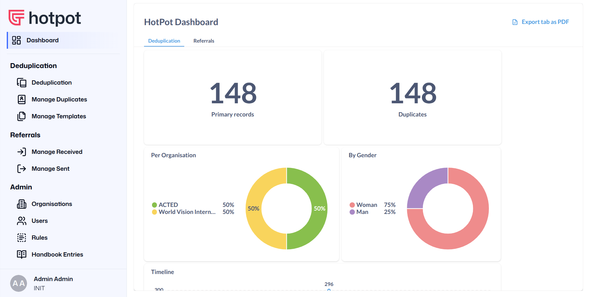

## Manage Duplicates

On this page you can view and manage potential duplicates which you have uploaded. We always refer to “potential” duplicates because we cannot be sure if a record is a duplicate until we have confirmed it with our colleagues in other organisations.

The Unresolved tab will show you potential duplicates which you need to check. In order to ensure data minimization, the Registry only holds the data fields which the Data Steward has decided are necessary to check for duplicates, e.g. the data defined by specific Rules.

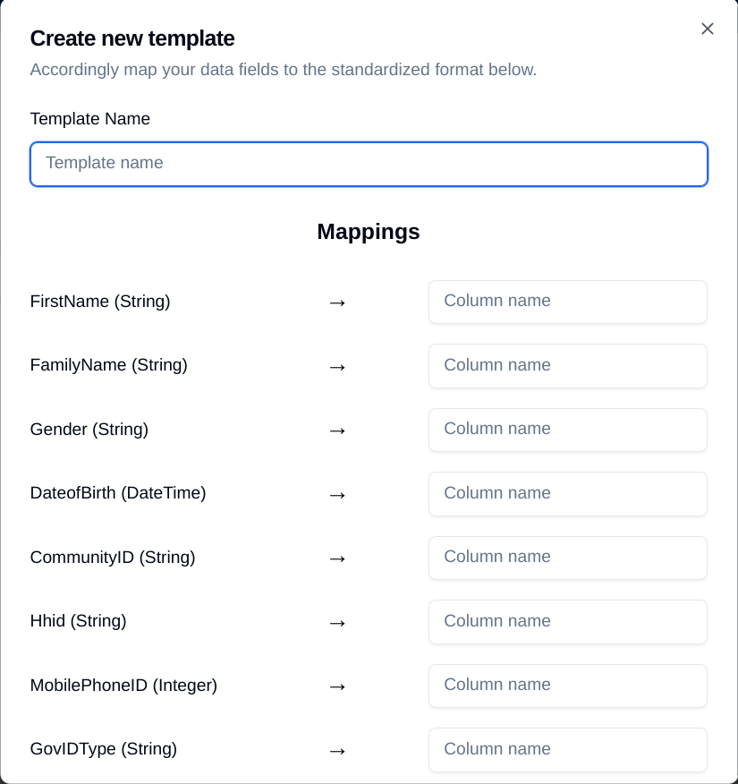

If you click on any row, the platform will take you to Beneficiary Preview, which shows you the details of the potential duplicate. At the top of the page you will see new information:

* The status of the duplicate (either unavailable, accepted, or rejected)
* The organisation which holds the primary record (i.e. the potential duplicate)

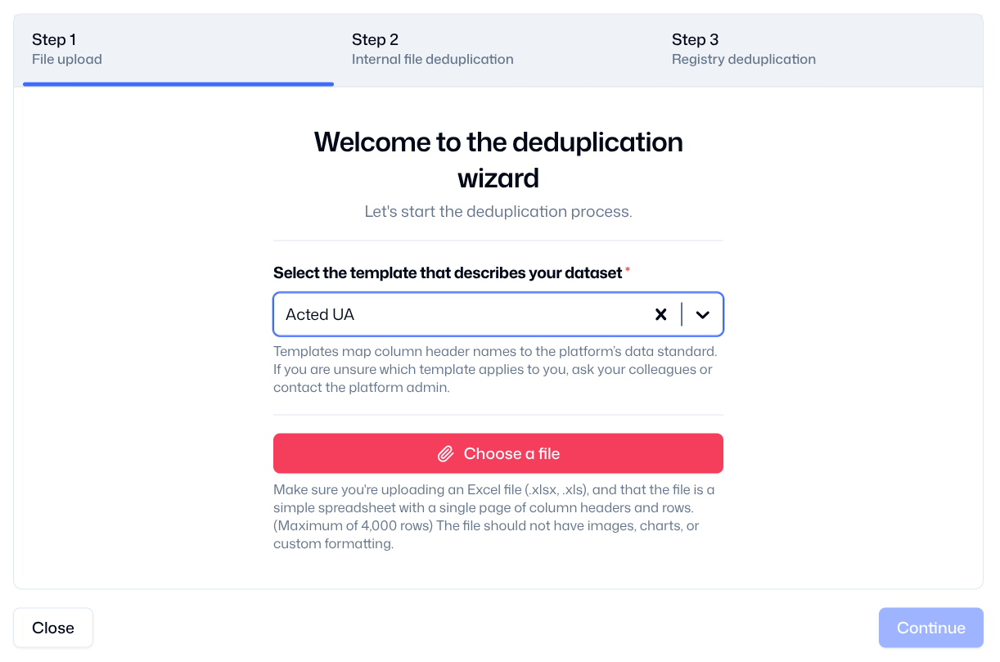

Under the primary record, the platform shows you the organisation which holds that record, the staff member who uploaded that record, when they uploaded it, and which fields are potential duplicates.

You can use this information to contact your colleague in the other organisation to discuss whether this is a real duplicate, and what action you will take. This is called the [Adjudication Process](deduplication.md#the-adjudication-process), which needs to be agreed by all participants.

Once the Adjudication Process is complete, you can change the status of the potential duplicate. In the top right corner of the Beneficiary Preview page, you will see a drop-down list entitled “Actions”.

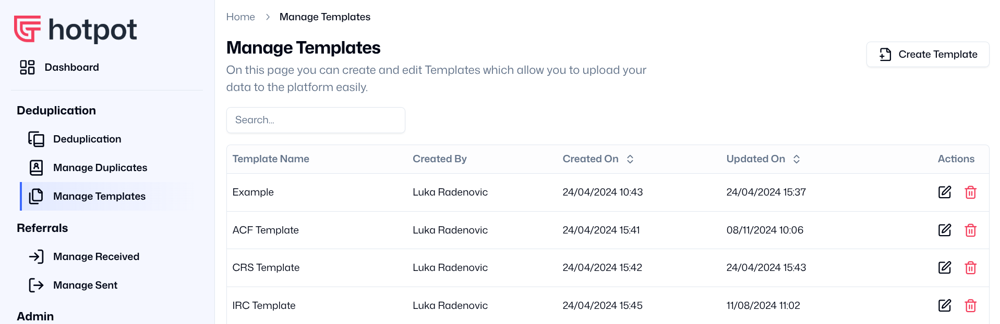

If the Adjudication Process is successful, and your reach agreement with your colleague, you can select one of these options.

* Accepted Duplicate. You confirm with your colleague that this is a duplicate record, but both your organisations will continue to work with this beneficiary or household (perhaps because you are delivering different modalities of assistance).
* Rejected Duplicate. You confirm with your colleague that this is **not** a duplicate record, and so your organisation will become the primary record holder in the Registry.
* Delete. You confirm with your colleague that this is a duplicate record, and your organisation will no longer work with this beneficiary or household. You can delete the record from the Registry, although you may decide to keep your internal records.

If you change the status of the record to “Accepted Duplicate” or “Rejected Duplicate”, the platform will move it from the “Unresolved” tab to the “Resolved” tab. You will be able to view this record when you switch views to that tab.

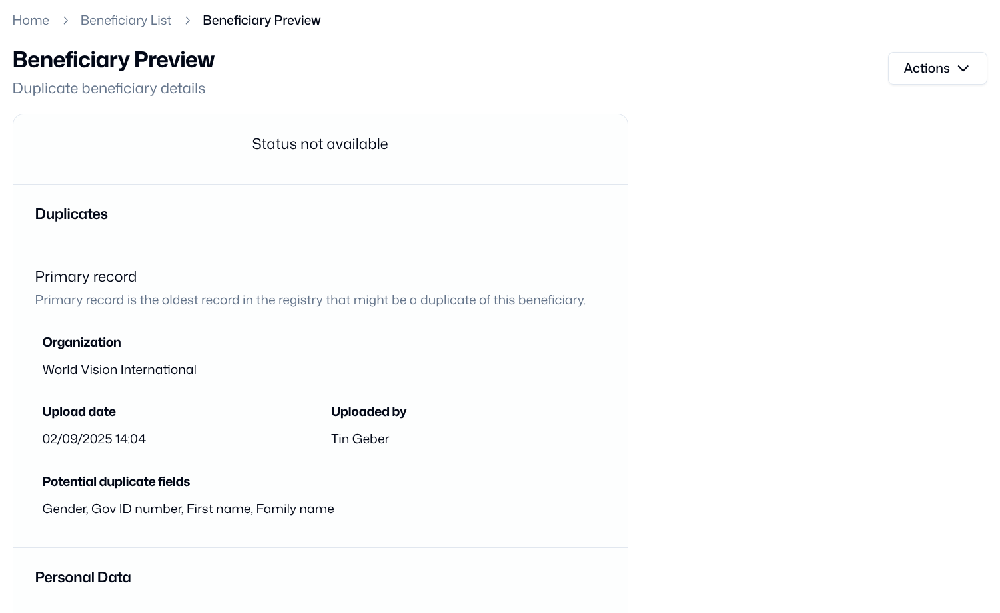

### The Adjudication Process

The Adjudication Process happens off-platform, and it usually requires discussion between partner organisations. The process must be agreed by all members of the Data Steward. This is an example of an Adjudication Process which you can adapt.

1. The organisation which uploads an individual record first is considered to be the Primary record holder.
2. If another organisation uploads a record which is a potential duplicate of the Primary record, they are a Secondary record holder.
3. The Secondary record holder should contact the Primary record holder to discuss the potential duplicate.
4. Adjudication is the process of comparing the Primary record to the Secondary record, and deciding jointly if they are duplicates or not.
5. There are three possible options at the end of the process:
    1. The potential duplicate is - Not a Duplicate! *Sometimes staff make a mistake in entering data, the platform makes a mistake in flagging a record, or there are simply two individuals who have similar personal information.*
    2. The potential duplicate is a duplicate, but Unclear. If there is not enough information to decide, the record can remain flagged as a potential duplicate in the registry. This option is not preferable, and you should look for more information to make a decision!

*Should the parties involved not arrive at consensus, three members of the Oversight Committee will be invited to mediate discussions within one week.*

## Manage Templates

If you click on “Manage Templates”, the platform will take you to the Templates Page.

Most deduplication platforms require you to upload your data in a specific format. This means that you have to spend time setting up your internal systems to output that format, or manually updating your spreadsheets to fit that format.

Templates enable the platform to “translate” your spreadsheet into a common format which enables data sharing. It does this by mapping the header labels from your spreadsheet to the labels in the registry (the shared database).

Each organisation can set up its own template, and it’s possible to set up multiple templates if you need to upload data from different sources. If you click on the “Create Template” button in the top right, you will see the “Create new template” box.

Choose a simple descriptive name for your template. You should then check the labels on the left, and then enter into the “Column name” boxes on the right the labels that your organisation’s spreadsheet uses as column **headers**. For example:

* The platform uses the label “FamilyName”, while your spreadsheet might use the header label “Last Name”. Type “Last Name” into the right hand column.
* The platform uses the label “DateofBirth”, while your spreadsheet might use the label “Date of Birth”. Type “Date of Birth” into the right hand column.
* etc

You only need to enter the Column names which are needed for deduplication. These labels should have been collectively agreed by all the partners which are using the platform for deduplication.

If you are not sure which labels are being used for deduplication, you should ask the focal point in your organisation, or ask a colleague from a partner organisation who is also using the platform.

Once you have finished entering the Column names, click on the “Create template” button. 

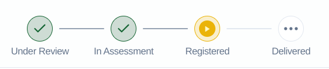

Clicking on the name of any Template in the list will take you to the “Template Edit/Preview” page. On this page you can view the Template details, update the mapping and change the name of the Template if you need to.

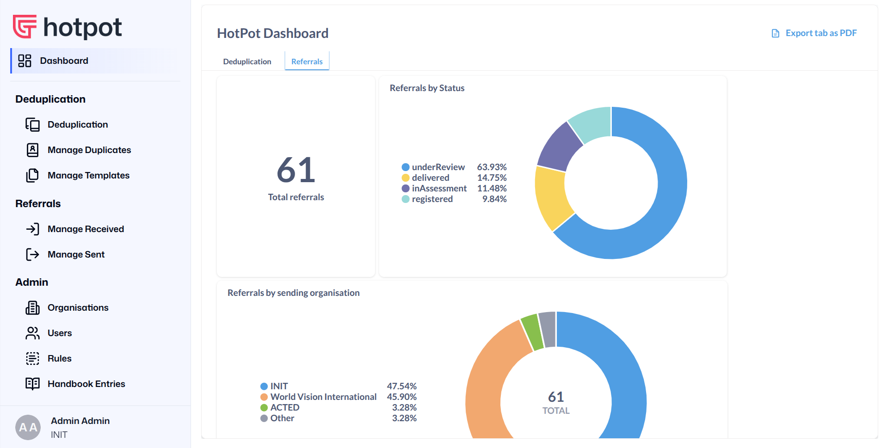
