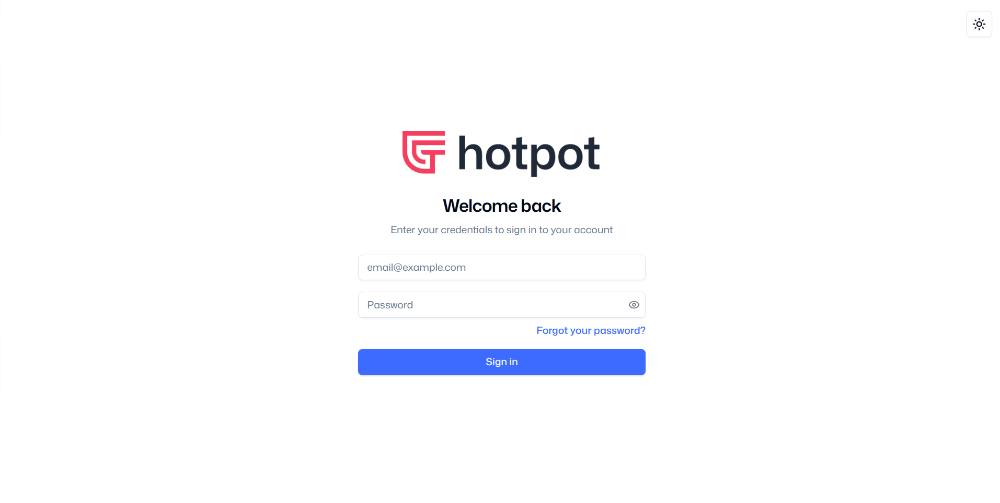

# Hotpot User Guide v3.0

*This document is accurate as of 2026/02/20. The platform is still under development, and the User Guide will be updated as new features are added.*

# Introduction

Welcome to the User Guide for HotPot, a data stewardship platform developed by the Collaborative Cash Delivery Network. The User Guide provides step-by-step instructions for accessing and using all the platform features, with screenshots to guide you through each process.

Your organisation will create an account for you. Each account can have different permissions. All accounts can [Log In](index.md#login-page) and view the [Dashboard](dashboard.md#accessing-the-platform-functions). Depending on your role in your organisation, you may also have permission to use the [Booking](bookings.md#how-to-manage-bookings) function, the [Deduplication](deduplication.md#how-to-manage-deduplication) function, the [Referral](referrals.md#how-to-manage-referrals) function, or all three.

# Login Page

The first thing you see when you visit the website is the Login Page. You can log in by entering your email address and a password.

Your account will be created by an administrator in your organisation. The administrator will let you know the email address and password that you should use.

If you do not know which email and password to use, contact the administrator for your organisation.

