# How to manage Referrals

The Referrals section of the menu on the left gives your two options:

* [Manage Received](referrals.md#manage-received). This menu option will take you to a page where you can view and manage the referrals that you have received from other organisations.
* [Manage Sent](referrals.md#manage-sent). This menu option will take you to a page where you can view and manage the referrals that you have sent to other organisations.

## How to create a Referral

In the right hand corner of the Manage Sent page, you can see the “New Case” button.

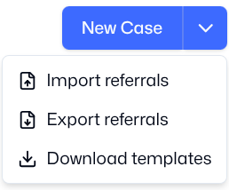

If you click the button directly, the platform will take you to a separate page to make a referral. You can also Import referrals (if you already have them on your device in the agreed format), Export referrals, and Download referral templates.

This page is modelled on the existing referral form agreed by the Ukraine Response Consortium. It contains all the fields necessary to make a referral.

Once you have filled out the fields necessary to make a referral, you can also upload additional information, such as image files. This is not mandatory.

Before you can make the referral, you must verify that the beneficiary has given their consent to share their data by clicking the toggle button.

Once you have completed the form and verified that consent has been given, you will see three buttons which give you different options:

1. Save Draft. Click on this button if you have not completed the referral form, and you want to save it to edit later.
2. Send Referral. Click on this button if you have completed the referral form, and you want to send it to the receiving organisation.
3. Cancel. Click on this button if you have started the referral form, but you do not wish to finish it or save it.

 Toggle and Buttons](images/image40.png)

## Manage Sent

On this page you can view the referrals that you have sent to other organisations, and you can create a new referral.

*The referrals that you have sent to other organisations are shown in a list. You can Search for a specific referral, or you can filter the referrals by Creator, by Step, by Recipient, by Activity, or by Date. The Actions column in the right show if you have permission to Edit or Delete the Referral.*

Above the list of referrals, you can see two Tabs: Sent, and Drafts.

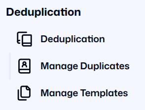

### Sent Tab

The Sent tab will show you referrals that have already been sent. It shows the Case number, the organisation which the referral was Sent to, the Status of the referral, and the dates the referral was Created on and Updated on.

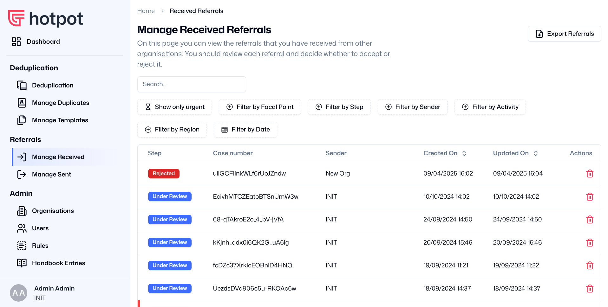

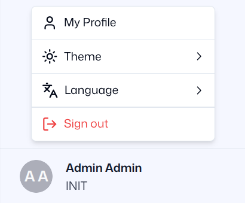

 You can also edit or delete referrals using the pen and paper icon or the trash icon on the right.

### Drafts Tab

The Drafts tab will show you referrals which you have drafted but not sent. You can edit these drafts by clicking on the Pen and Paper icon on the right.

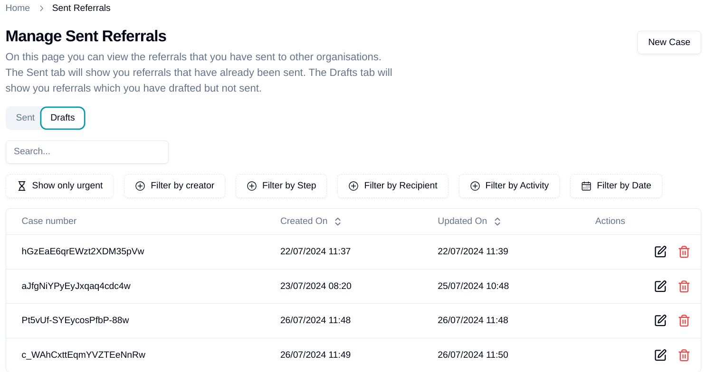

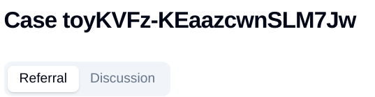

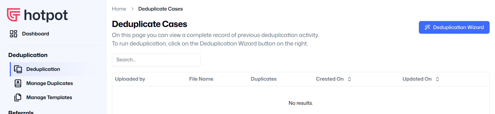

#### How to Withdraw a Referral

While the SO has responsibility for a Case, it can edit or withdraw any referral that it has sent. The RO will be able to see that the referral has been edited or withdrawn. The SO can then delete the Referral completely, or send it to a new SO.

## Manage Received

On this page you can view the referrals that you have received from other organisations. The referrals that you have received from other organisations are shown in a Referral List.

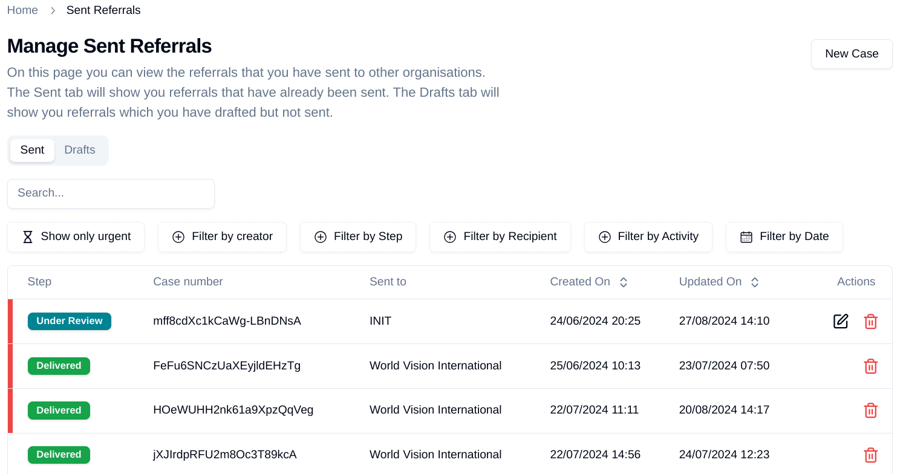

The List shows the Case number, the organisation which is the Sender of the referral, the Status of the referral, and the dates the referral was Created on and Updated on.

### Viewing Referrals

The functions available to you on this page are:

#### Search for a specific Referral

You can search for a specific referral by typing any search term into the Search Box.

#### Filter the Referral List

Below the Search Box you will see options for filtering the referrals by different variables:

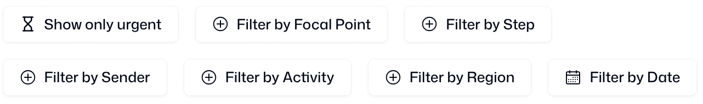

Most of these variables are easy to understand. Filter by Step is more complicated, and it is important that you understand what each Step means. You can learn more in the section below titled “[Understanding the Steps in a Referral](referrals.md#understanding-the-steps-in-a-referral)”.

#### View the details of a specific Referral

If you click on any part of a line which shows a Case in the List, it will take you to a new page containing the [Individual Case Details](referrals.md#individual-case-details).

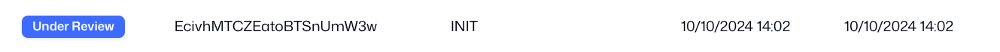

#### 

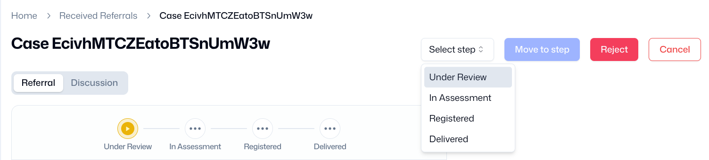

Delete a specific Case

You can delete a Case by clicking the Trashcan icon at the end of the line.

If you click the Trashcan, you will see a pop-up box asking if you are sure.

You should not click “Confirm” unless you are absolutely certain that you want to delete the Case. Once you delete the Case, it cannot be retrieved!

#### Export a list of Referrals 

You can Export a list of Referrals by clicking the Export Referrals button in the top right corner. The list will be downloaded as an Excel file with all the details for each Case.

### Individual Case Details

The platform gives each case a unique Case Number. When you view a specific referral case, the Case Number will appear at the top of the page.

To the right of the Case Number, you can see a drop-down list and some buttons. You will use these buttons to manage the referral, and we explain each button later in this section.

Below the Case Number, you can see two Tabs: Referral, and Discussion.

Discussion Tabs](images/image54.png)

Discussion Tabs")

#### Referral tab

The Referral Tab is the default view on this page. In the Referral Tab, you can view all the details of the Referral.

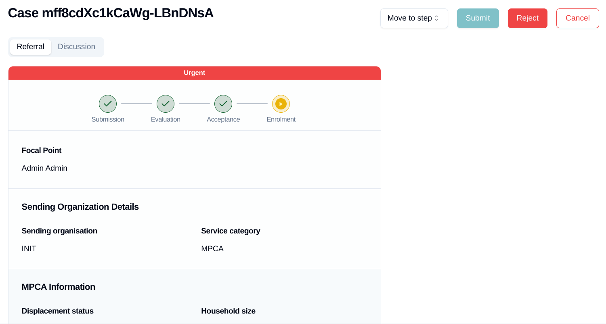

At the top you can see a visual representation of the status of the case, and how far the referral process has progressed through the Steps. You can learn more about the Steps in the section below titled “[Understanding the Steps in a Referral](referrals.md#understanding-the-steps-in-a-referral)”.

#### 

Discussion Tab

In the Discussion tab, you can see the progress of the referral through the different steps of the process, with the dates and times given. You can also send messages, updates and requests for information to the Sending or Receiving Organisation. 

Discussion Tab Screen](images/image57.png)

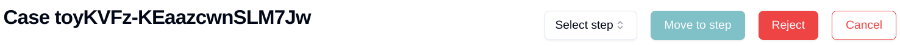

This ensures a record of the referral for future reference by both the Sending and the Receiving Organisation.

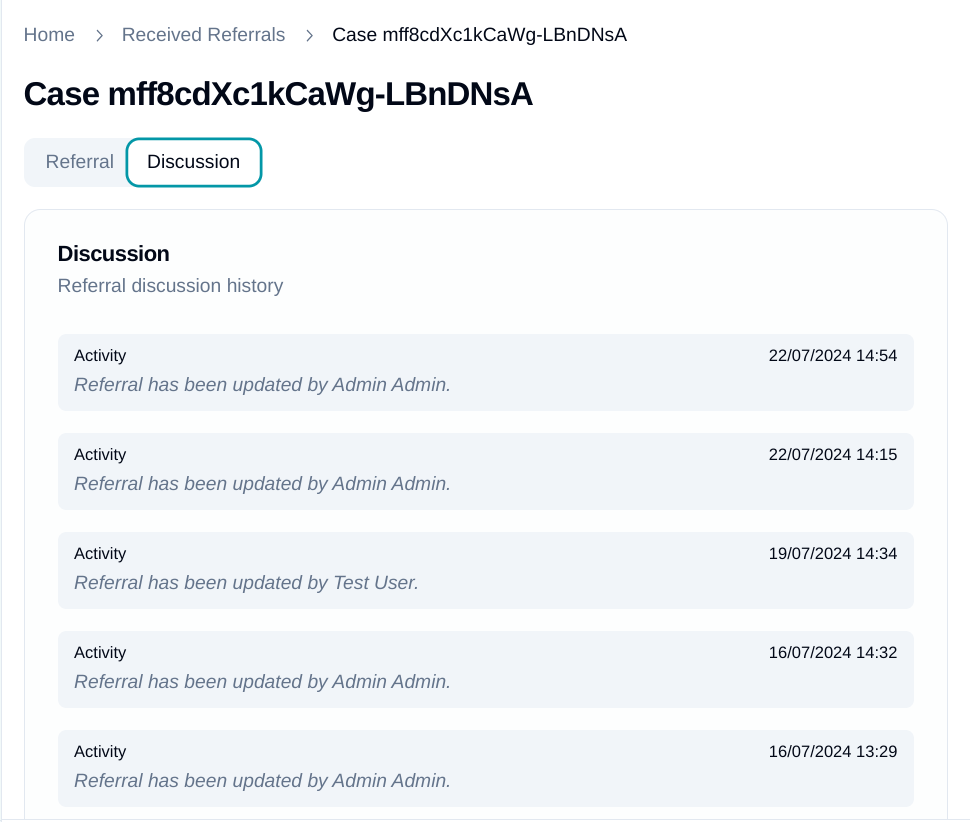

Discussion Tab")

### Understanding the Steps in a Referral

A Referral Case goes through several Steps. These Steps are shown at the top of a page when you view an Individual Case Detail, and they will help you to understand whether the referral is making progress or has been completed.

When a Case moves to the next Step, you can change the Step by using the drop-down list in the top right of the screen for an individual Case. Select a step, click on the button “Move to Step”, and the Case will be updated.

 Explanations of each step are given below.

#### Under Review

The Sending Organisation (SO) sends the Referral Form to another organisation on the platform (the Receiving Organisation, or RO) because they believe that the RO can provide the support needed by the beneficiary. Once the RO receives the referral, it is labelled on the platform as **Under Review**.

#### In assessment

The RO reviews the case based on the information in the Referral Form. They will then decide whether this case is suitable for their organisation - based on whether they have the capacity, for example, or whether they still work in that location or sector. The RO will then decide whether

1. To accept the referral, in which case it will be labelled as **In** **Assessment**.
2. To reject the referral, in which case it will be returned to the SO for follow-up.

#### Registered

The RO assesses the case, perhaps sending their staff to visit the individual’s location. This assessment will check if the referral service is really needed, and if they are able to provide that service. The RO will then decide whether

1. To register the individual, in which case it will be labelled as **Registered**.
2. To reject the referral, in which case it will be returned to the SO for follow-up.

**IMPORTANT NOTE: The SO has responsibility for a Case until the RO registers the beneficiary. Once the RO registers the beneficiary, it takes formal responsibility for that case, and the SO cannot make any further changes to the referral form.**

#### Delivered

The RO will then provide the service that was requested in the referral. If the service which has been delivered is time-limited, they can mark the referral as **Delivered**. If the service is not time-limited, the RO can retain the Registered status indefinitely.

### What happens if a Referral is rejected?

If the RO decides to reject a Referral, it is returned to the SO. The RO should send a message in the Discussion tab, to explain why it has been rejected. The SO can then withdraw the Referral, and potentially send it to a new RO. The Individual Case remains on the platform unless the SO deletes it.
